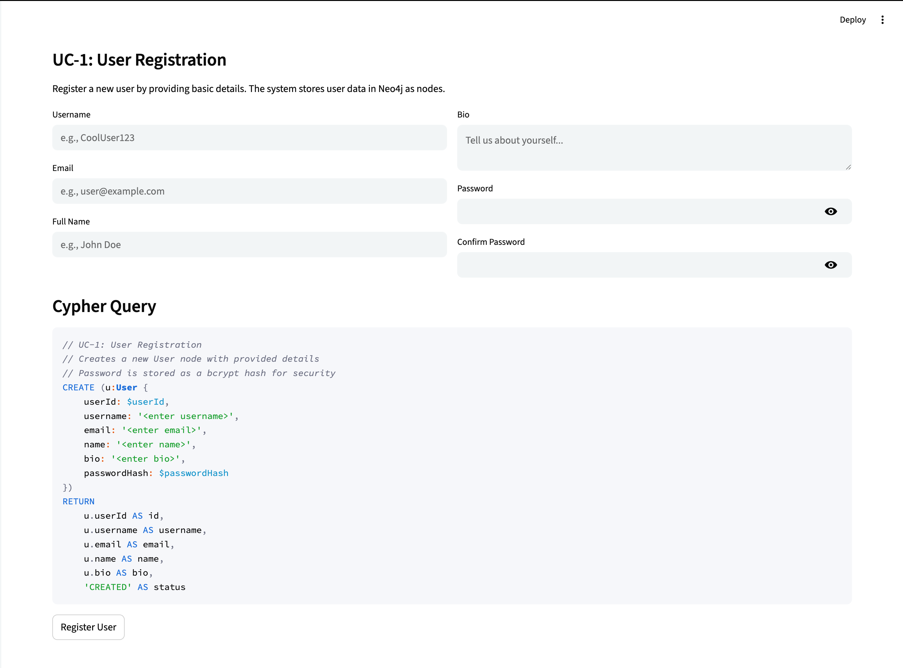
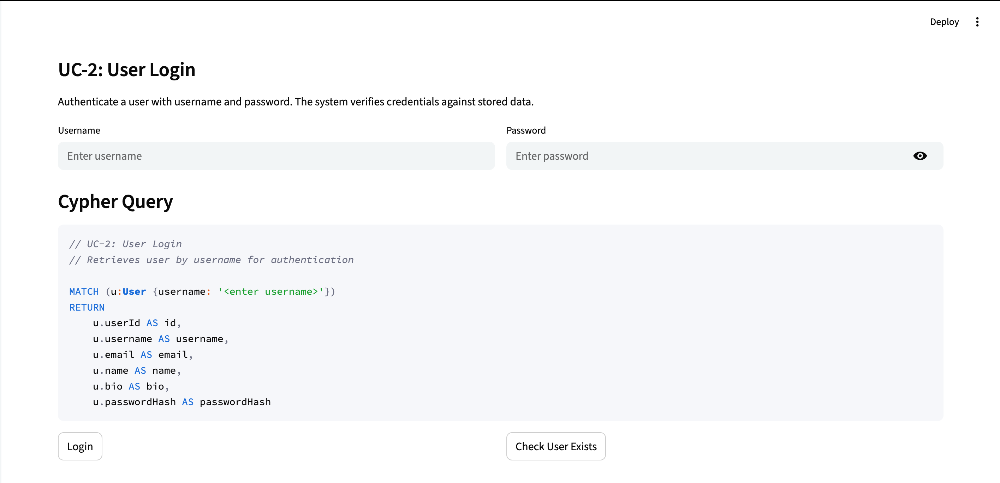
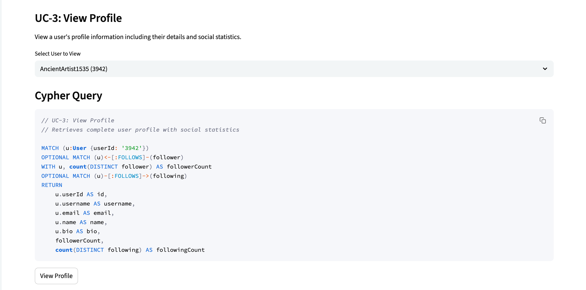
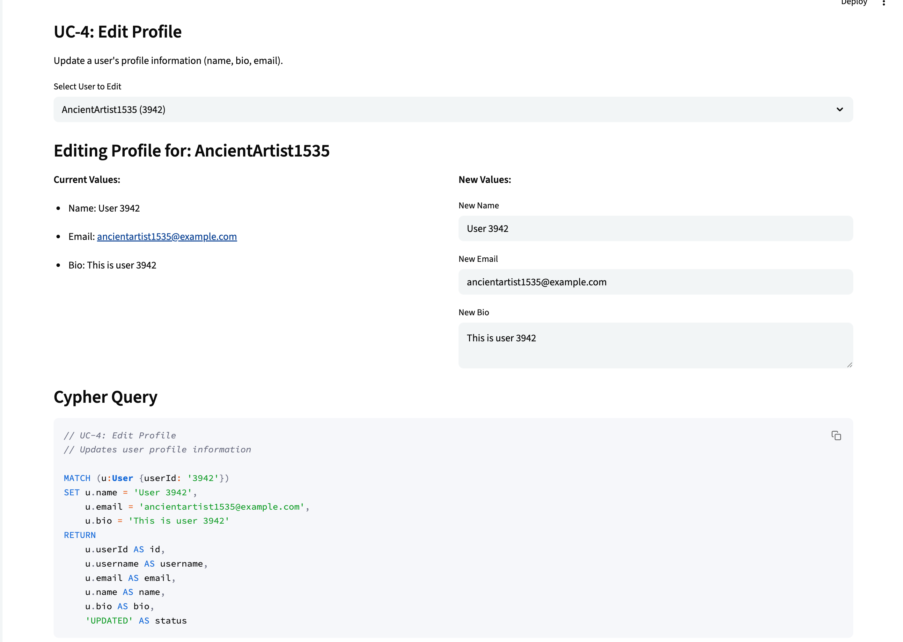
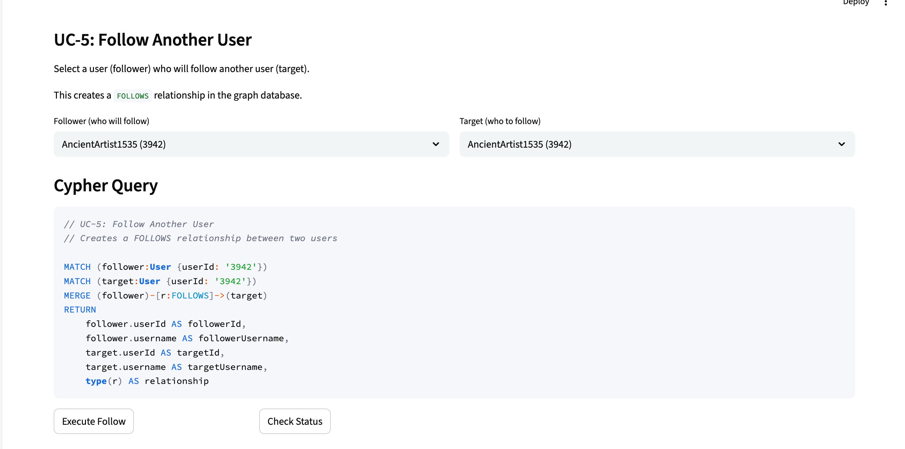
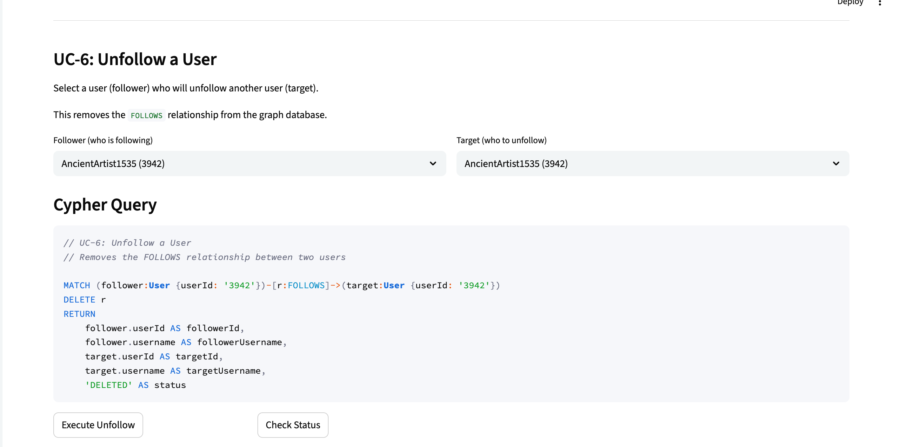
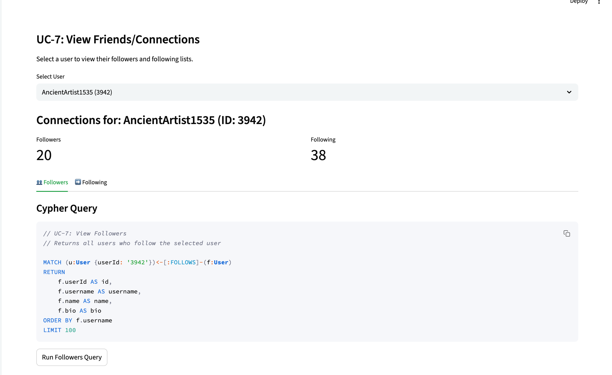
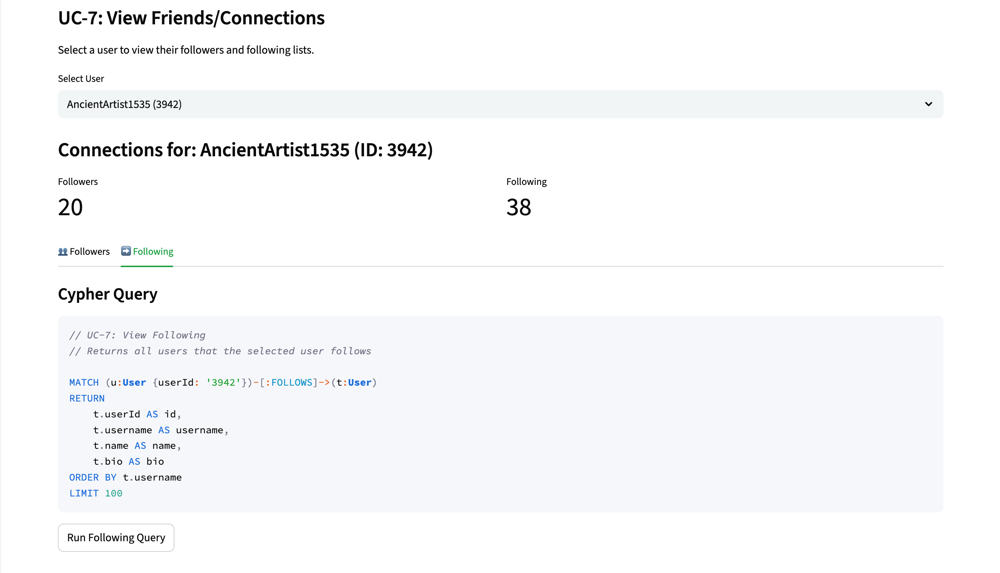
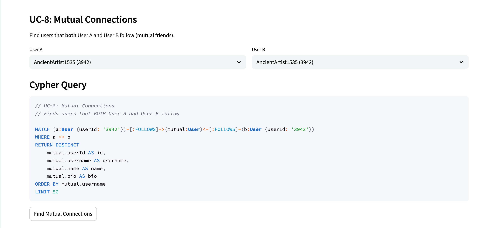
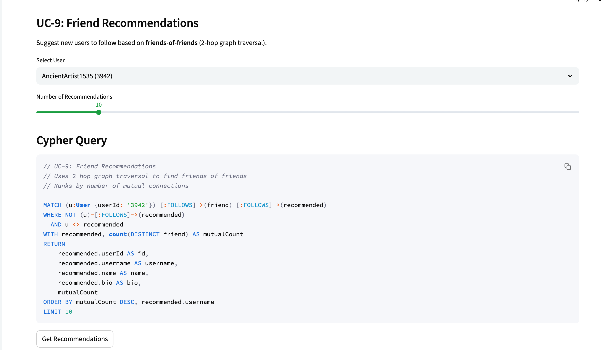

# CS157C: NoSQL Database Systems
## Final Project Report
### Social Network Graph Application

---

## Table of Contents

| Section | Use Cases | Owner |
|---------|-----------|-------|
| [Team Information](#team-information) | — | — |
| [Property Graph Schema](#property-graph-schema) | — | Aditya |
| [Dataset Information](#dataset-information) | — | Aditya |
| **User Management** | | |
| [UC-1: User Registration](#uc-1-user-registration) | UC-1 | Timothy |
| [UC-2: User Login](#uc-2-user-login) | UC-2 | Timothy |
| [UC-3: View Profile](#uc-3-view-profile) | UC-3 | Timothy |
| [UC-4: Edit Profile](#uc-4-edit-profile) | UC-4 | Timothy |
| **Social Graph Features** | | |
| [UC-5: Follow Another User](#uc-5-follow-another-user) | UC-5 | Jakob |
| [UC-6: Unfollow a User](#uc-6-unfollow-a-user) | UC-6 | Jakob |
| [UC-7: View Friends/Connections](#uc-7-view-friendsconnections) | UC-7 | Jakob |
| [UC-8: Mutual Connections](#uc-8-mutual-connections) | UC-8 | Jakob |
| [UC-9: Friend Recommendations](#uc-9-friend-recommendations) | UC-9 | Jakob |
| **Search & Exploration** | | |
| [UC-10: Search Users](#uc-10-search-users) | UC-10 | Aditya |
| [UC-11: Explore Popular Users](#uc-11-explore-popular-users) | UC-11 | Aditya |

---

## Team Information

| Name | Email | Responsibilities |
|------|-------|------------------|
| Aditya Dawadikar | aditya.dawadikar@sjsu.edu | Dataset, Schema, Search & Exploration (UC-10, UC-11) |
| Jakob Kauffmann | jakob.kauffmann@sjsu.edu | Social Graph Features (UC-5 through UC-9) |
| Timothy | {**TODO** add email}@sjsu.edu | User Management (UC-1 through UC-4) |

---

## Property Graph Schema

### Node: User

The `User` node represents a user in the social network.

| Property | Type | Description |
|----------|------|-------------|
| userId | STRING | Zero-padded unique ID (0001...5000) |
| username | STRING | Generated unique username |
| email | STRING | User email address |
| name | STRING | Full display name |
| bio | STRING | Short profile biography |
| passwordHash | STRING | bcrypt hashed password |

### Relationship: FOLLOWS

The `FOLLOWS` relationship represents a directed edge from User A to User B, indicating that User A follows User B.

```
(UserA:User)-[:FOLLOWS]->(UserB:User)
```

This is a directed relationship, meaning if User A follows User B, it does not imply that User B follows User A.

---

## Dataset Information

### Dataset Source

- **Name:** Synthetic Social Network Dataset
- **Type:** Generated using Python scripts
- **Size:** 5,000 users, 15,000+ FOLLOWS relationships

### Dataset Description

The dataset is synthetically generated to simulate a realistic social network with:

- **User Generation:** 5,000 unique users with randomized usernames (Adjective + Noun + Number format)
- **Cluster Behavior:** Users are organized into 20 clusters for realistic community structure
- **Influencers:** 20 users with 1,000-3,500 followers each
- **Ghost Accounts:** 800 users with 0 followers (inactive accounts)
- **Normal Users:** Follow 3-50 users, primarily within their cluster

### Data Processing and Loading

The data was generated and loaded using the following Python scripts:

1. `generate_users.py` - Creates 5,000 unique user records with bcrypt-hashed passwords
2. `generate_graph.py` - Creates FOLLOWS relationships with realistic social patterns
3. `ingest_graph.py` - Loads CSV data into Neo4j database

### Cypher Statements for Data Creation

**Create Constraints:**
```cypher
CREATE CONSTRAINT user_id_unique IF NOT EXISTS
FOR (u:User) REQUIRE u.userId IS UNIQUE;

CREATE CONSTRAINT username_unique IF NOT EXISTS
FOR (u:User) REQUIRE u.username IS UNIQUE;
```

**Load Users:**
```cypher
UNWIND $rows AS row
MERGE (u:User {userId: row.userId})
SET u.username = row.username,
    u.email = row.email,
    u.name = row.name,
    u.bio = row.bio,
    u.passwordHash = row.passwordHash;
```

**Load FOLLOWS Relationships:**
```cypher
UNWIND $rows AS row
MATCH (f:User {userId: row.followerId})
MATCH (t:User {userId: row.followeeId})
MERGE (f)-[:FOLLOWS]->(t);
```

---

## Use Case Evidence

**Screenshot Requirements:** 12 screenshots total (1 per use case, except UC-7 which requires 2)

---

### UC-1: User Registration

**Description:** A new user can sign up by providing basic details (name, email, username, password). The system stores user data in Neo4j as nodes with a bcrypt-hashed password for security.

**Cypher Query:**
```cypher
CREATE (u:User {
    userId: $userId,
    username: $username,
    email: $email,
    name: $name,
    bio: $bio,
    passwordHash: $passwordHash
})
RETURN 
    u.userId AS id,
    u.username AS username,
    u.email AS email,
    u.name AS name,
    u.bio AS bio,
    'CREATED' AS status
```

**Implementation Notes:**
- Generates unique user ID by incrementing the maximum existing ID
- Password is hashed using bcrypt before storage
- Validates username and email uniqueness before creation
- Returns created user data (excluding password hash)

**Screenshot:** *(1 screenshot required)*



---

### UC-2: User Login

**Description:** A registered user can log in using their username and password. The system authenticates the credentials by retrieving the user and verifying the password hash using bcrypt.

**Cypher Query:**
```cypher
MATCH (u:User {username: $u})
RETURN 
    u.userId AS id, 
    u.username AS username, 
    u.passwordHash AS phash,
    u.name AS name, 
    u.bio AS bio
```

**Implementation Notes:**
- Retrieves user record by username
- Password verification performed in application layer using `bcrypt.checkpw()`
- On successful login, user session is created in Streamlit's `session_state`
- Password hash is never exposed to the UI

**Screenshot:** *(1 screenshot required)*



---

### UC-3: View Profile

**Description:** A user can view their own profile including basic information and social statistics (follower count, following count).

**Cypher Query:**
```cypher
MATCH (u:User {userId: $id})
RETURN 
    SIZE([(u)-[:FOLLOWS]->(t) | t]) AS following,
    SIZE([(f)-[:FOLLOWS]->(u) | f]) AS followers
```

**Implementation Notes:**
- Uses list comprehension pattern `[(pattern) | variable]` to count relationships
- Efficiently calculates both follower and following counts in a single query
- Profile data (name, bio, email) is retrieved from the login session
- Displayed in the User View panel after successful login

**Screenshot:** *(1 screenshot required)*



---

### UC-4: Edit Profile

**Description:** A user can update their name, bio, email, and other profile details. The system validates the changes and updates the user node in Neo4j.

**Cypher Query:**
```cypher
MATCH (u:User {userId: $userId})
SET u.name = $newName,
    u.email = $newEmail,
    u.bio = $newBio
RETURN 
    u.userId AS id,
    u.username AS username,
    u.email AS email,
    u.name AS name,
    u.bio AS bio,
    'UPDATED' AS status
```

**Implementation Notes:**
- Uses `SET` to update multiple properties atomically
- Validates email uniqueness if email is changed
- Password can be updated separately with new bcrypt hash
- Returns updated profile data for confirmation

**Screenshot:** *(1 screenshot required)*



---

### UC-5: Follow Another User

**Description:** A user can follow another user, creating a `FOLLOWS` relationship in Neo4j. The relationship is stored as a directed edge in the graph database, representing a one-way connection from the follower to the user being followed.

**Cypher Query:**
```cypher
MATCH (follower:User {userId: $followerId})
MATCH (target:User {userId: $targetId})
MERGE (follower)-[r:FOLLOWS]->(target)
RETURN 
    follower.userId AS followerId,
    follower.username AS followerUsername,
    target.userId AS targetId,
    target.username AS targetUsername,
    type(r) AS relationship
```

**Implementation Notes:**
- Uses `MERGE` to prevent duplicate relationships
- Validates that a user cannot follow themselves
- Checks if relationship already exists before creating
- Returns confirmation of the created relationship

**Screenshot:** *(1 screenshot required)*



---

### UC-6: Unfollow a User

**Description:** A user can unfollow another user, removing the `FOLLOWS` relationship from the graph database. This operation deletes the directed edge between the two users.

**Cypher Query:**
```cypher
MATCH (follower:User {userId: $followerId})-[r:FOLLOWS]->(target:User {userId: $targetId})
DELETE r
RETURN 
    follower.userId AS followerId,
    follower.username AS followerUsername,
    target.userId AS targetId,
    target.username AS targetUsername,
    'DELETED' AS status
```

**Implementation Notes:**
- Uses pattern matching to find the exact relationship
- Validates relationship exists before deletion
- Only deletes the specific `FOLLOWS` edge, not the nodes
- Provides feedback on successful deletion

**Screenshot:** *(1 screenshot required)*



---

### UC-7: View Friends/Connections

**Description:** A user can see a list of people they are following (outgoing `FOLLOWS` relationships) and who follow them (incoming `FOLLOWS` relationships). This provides a complete view of a user's social connections.

**Cypher Query - View Followers:**
```cypher
MATCH (u:User {userId: $userId})<-[:FOLLOWS]-(f)
RETURN 
    f.userId AS id,
    f.username AS username,
    f.name AS name,
    f.bio AS bio
ORDER BY username
```

**Cypher Query - View Following:**
```cypher
MATCH (u:User {userId: $userId})-[:FOLLOWS]->(t)
RETURN 
    t.userId AS id,
    t.username AS username,
    t.name AS name,
    t.bio AS bio
ORDER BY username
```

**Implementation Notes:**
- Admin view provides dropdown to select any user from the database
- Separates followers and following into distinct query panels
- Uses directional relationship patterns (`<-[:FOLLOWS]-` vs `-[:FOLLOWS]->`)
- User View displays results in tabbed interface with graph visualization

**Graph Visualization:** The UI displays followers/following as node clusters using PyVis, with user labels shown on each node. This helps users visually understand their network connections.

**Screenshots:** *(2 screenshots required)*





---

### UC-8: Mutual Connections

**Description:** A user can see mutual friends—users who are followed by both User A and User B. This feature demonstrates Neo4j's pattern matching capability to find intersection patterns in the graph.

**Cypher Query:**
```cypher
MATCH (a:User {userId: $userAId})-[:FOLLOWS]->(mutual:User)<-[:FOLLOWS]-(b:User {userId: $userBId})
WHERE a <> b
RETURN DISTINCT
    mutual.userId AS id,
    mutual.username AS username,
    mutual.name AS name,
    mutual.bio AS bio
ORDER BY mutual.username
LIMIT 50
```

**Implementation Notes:**
- Uses a single pattern to match both relationships simultaneously
- The pattern `(a)-[:FOLLOWS]->(mutual)<-[:FOLLOWS]-(b)` finds users followed by both A and B
- `WHERE a <> b` ensures we're comparing two different users
- `DISTINCT` prevents duplicate results
- Efficient graph traversal compared to SQL JOIN operations

**Graph Visualization:** The PyVis visualization displays User A and User B as distinct colored nodes, with mutual connections shown between them. Directed edges illustrate the FOLLOWS relationships from both users to their shared connections.

**Screenshot:** *(1 screenshot required)*



---

### UC-9: Friend Recommendations

**Description:** The system suggests new people to follow based on common connections using graph traversal queries. This implements a "friends-of-friends" algorithm that recommends users followed by people you follow, but whom you don't follow yet.

**Cypher Query:**
```cypher
MATCH (u:User {userId: $userId})-[:FOLLOWS]->(friend)-[:FOLLOWS]->(recommended)
WHERE NOT (u)-[:FOLLOWS]->(recommended)
  AND u <> recommended
WITH recommended, count(DISTINCT friend) AS mutualCount
RETURN 
    recommended.userId AS id,
    recommended.username AS username,
    recommended.name AS name,
    recommended.bio AS bio,
    mutualCount
ORDER BY mutualCount DESC, recommended.username
LIMIT $limit
```

**Implementation Notes:**
- **2-hop traversal:** The pattern `(u)-[:FOLLOWS]->(friend)-[:FOLLOWS]->(recommended)` finds users two steps away in the graph
- **Exclusion filter:** `WHERE NOT (u)-[:FOLLOWS]->(recommended)` ensures we don't recommend users already followed
- **Self-exclusion:** `u <> recommended` prevents recommending the user to themselves
- **Ranking:** Results are ordered by `mutualCount`, giving priority to stronger recommendations
- **Aggregation:** Uses `count(DISTINCT friend)` to count mutual connections
- This query demonstrates the power of graph databases for social network analytics

**Graph Visualization:** The PyVis graph displays the center user prominently, with recommended users shown as connected nodes. Node sizes are scaled by mutual connection count, making stronger recommendations visually distinct.

**Screenshot:** *(1 screenshot required)*



---

### UC-10: Search Users

**Description:** A user can search for other users by name or username. The system returns a list of matching users using case-insensitive partial matching.

**Cypher Query:**
```cypher
MATCH (u:User)
WHERE toLower(u.username) CONTAINS toLower($q)
   OR toLower(u.name) CONTAINS toLower($q)
RETURN u.userId AS id, u.username, u.name, u.bio
LIMIT 50
```

**Implementation Notes:**
- Uses `toLower()` for case-insensitive matching
- Uses `CONTAINS` for partial string matching (substring search)
- Searches both username and name fields simultaneously
- Limited to 50 results for performance
- Search term passed as `$q` parameter

**Screenshot:** *(1 screenshot required)*


---

### UC-11: Explore Popular Users

**Description:** The system displays the most-followed users, ranked by their follower count. This showcases the "influencers" in the social network.

**Cypher Query:**
```cypher
MATCH (u:User)
OPTIONAL MATCH (u)<-[:FOLLOWS]-(f)
WITH u, count(f) AS followerCount
RETURN u.userId AS id, u.username AS username, u.name AS name, followerCount
ORDER BY followerCount DESC
LIMIT 20
```

**Implementation Notes:**
- Uses `OPTIONAL MATCH` to include users with zero followers
- Aggregates follower count using `count()`
- `WITH` clause creates intermediate result for aggregation
- Orders by follower count descending to show most popular first
- Limited to top 20 users

**Screenshot:** *(1 screenshot required)*


---

## Appendix: Technology Stack

| Component | Technology |
|-----------|------------|
| Database | Neo4j 5.x |
| Query Language | Cypher |
| Backend | Python 3.x |
| Frontend | Streamlit |
| Graph Visualization | PyVis |
| Password Security | bcrypt |
| Data Processing | Pandas |

